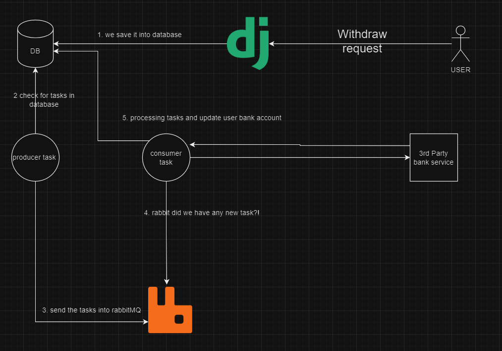

# simple-wallet-improved
improved version of [simple wallet]("https://google.com")

this project's idea is to develop an online wallet with two features.

1. Deposit into the wallet
2. withdrawal from wallet with time in the future

the deposit into the wallet is not a big deal, our problem starts with Withdraw.

we have to schedule a withdrawal in the future and for this withdrawal, we have to call a third-party server(assume that it's a bank API) and charge the user account on that third party and if everything goes right we update our database and user wallet. the diagram below shows a simplified version of what have i done in this repository for the withdrawal section:

## License

This project is licensed under the MIT License - see the [LICENSE](./LICENSE) file for details.
